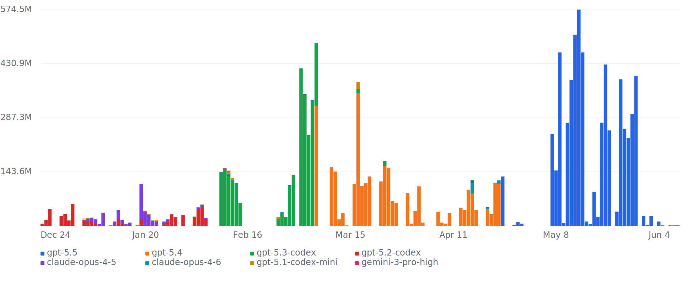

### Hi 👋, I'm Lu Zeyu

- 🌄 I like training interesting **transformers**.

- 🌠 The maximum model size I have trained from scratch is **3B**, using **128 A100 GPUs**. Looking forward to the opportunity to use more GPUs to train larger models in the future!

- 📫 How to reach me: **leo1037987031@gmail.com**

<!-- TOKEN_USAGE_START -->
## Token Usage

<table>
  <thead>
    <tr>
      <th align="left">Tool</th>
      <th align="right">All-time</th>
      <th align="right">30d</th>
      <th align="right">7d</th>
      <th align="left">Top models</th>
      <th align="left">Last seen</th>
    </tr>
  </thead>
  <tbody>
  <tr>
    <td><strong>Codex</strong></td>
    <td align="right"><code>12.08B</code></td>
    <td align="right"><code>31.8M</code></td>
    <td align="right"><code>28.7M</code></td>
    <td><code>gpt-5.5</code> <code>gpt-5.4</code> <code>gpt-5.3-codex</code></td>
    <td><code>2026-07-03</code></td>
  </tr>
  <tr>
    <td><strong>Claude Code</strong></td>
    <td align="right"><code>404.1M</code></td>
    <td align="right"><code>0</code></td>
    <td align="right"><code>0</code></td>
    <td><code>claude-opus-4-5</code> <code>claude-opus-4-6</code> <code>gemini-3-pro-high</code></td>
    <td><code>2026-04-23</code></td>
  </tr>
  </tbody>
</table>

<!-- TOKEN_USAGE_END -->
